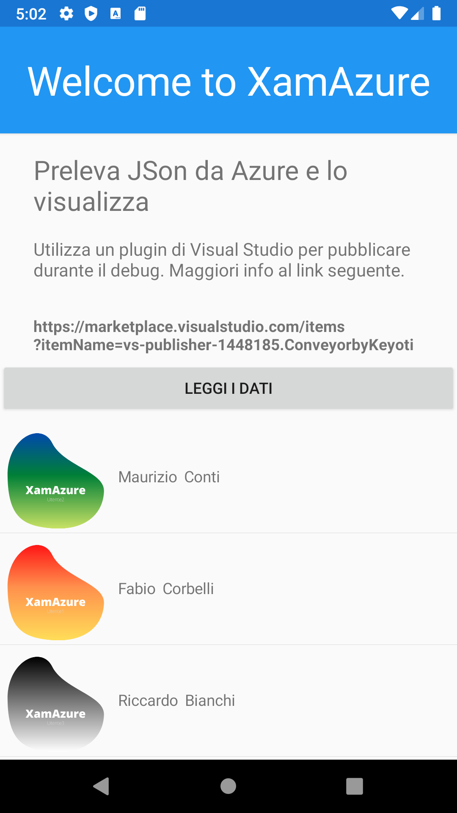

# XamAzure
### La più semplice WebApi Azure con la più semplice App Xamarin che la usa, per partire.

*Attenzione: manca la parte di autenticazione...*

_Si pensa di utilizzare il framework .NET Identity_

**Versione beta**

__Non usare per app reali__

***si accettano fork per farla crecere***

~~questo testo è sottolineato~~

> Questo testo quotato, è per informare che l'applicazione è stata realizzata in un contesto didattico insieme ai ragazzi di 5°H nell'anno scolastico 2020-21 presso l'ITTS "Belluzzi - da Vinci" di Rimini

## Elenco delle funzionalità

* Testata su
  * Android
    * con simulatore Android versione 11.0 - R (Api 30)
  * iOS
    * con simulatore iPhone 12 iOS 14.x
